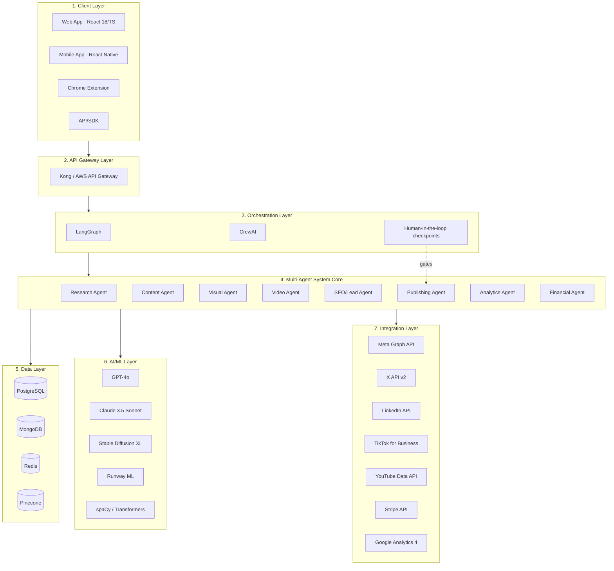

# 🏗️ SocialMediaAI — Architecture Overview

## System Layers

### 1. Client Layer
- Web App (React 18 + TypeScript)
- Mobile App (React Native)
- Chrome Extension
- API/SDK for integrations

### 2. API Gateway Layer
- Kong / AWS API Gateway
- Rate Limiting (100 req/min free, 1000 req/min pro)
- Authentication (JWT + OAuth2)
- Request Validation
- Load Balancing

### 3. Orchestration Layer
- LangGraph for workflow orchestration
- CrewAI for multi-agent collaboration
- State management for campaign workflows
- Human-in-the-loop checkpoints

### 4. Multi-Agent System Core
- Research Agent (CrewAI + GPT-4o)
- Content Agent (CrewAI + Claude 3.5)
- Visual Agent (ComfyUI + SDXL)
- Video Agent (Runway ML + GPT-4o)
- SEO/Lead Agent (LangChain + GPT-4o)
- Publishing Agent (Custom + n8n)
- Analytics Agent (Python + Custom ML)
- Financial Agent (Stripe API + Python)

### 5. Data Layer
- PostgreSQL (Primary DB: users, campaigns, posts, billing)
- MongoDB (Content DB: post content, assets, templates)
- Redis (Cache, sessions, rate limiting, job queues)
- Pinecone (Vector DB: embeddings, semantic search)

### 6. AI/ML Layer
- OpenAI GPT-4o (content generation, reasoning)
- Claude 3.5 Sonnet (content creation)
- Stable Diffusion XL (image generation)
- Runway ML (video generation)
- spaCy + Transformers (NLP)

### 7. Integration Layer
- Meta Graph API (Instagram, Facebook)
- X API v2 (Twitter)
- LinkedIn API
- TikTok for Business API
- YouTube Data API
- Stripe API (payments)
- Google Analytics 4 API

## Layer Diagram

## Mapping to Current Codebase

The repository currently implements a **baseline, in-process version** of layers 3–4 (no
CrewAI/LangGraph runtime yet, no external model calls) so the pipeline is testable end-to-end
today, with clear seams to swap in the full stack described above.

| Architecture layer | Target tech | Current implementation |
|---|---|---|
| Orchestration | LangGraph, CrewAI | [src/orchestrator/graph.py](src/orchestrator/graph.py) — sequential agent pipeline over [src/orchestrator/state.py](src/orchestrator/state.py) |
| Research Agent | CrewAI + GPT-4o | [src/agents/trend_research.py](src/agents/trend_research.py) |
| Content Agent | CrewAI + Claude 3.5 | [src/agents/content_creation.py](src/agents/content_creation.py) |
| Visual/Video Agent | ComfyUI/SDXL, Runway ML | not yet implemented (Phase 3) |
| SEO/Lead Agent | LangChain + GPT-4o | not yet implemented (Phase 5) |
| Publishing Agent | Custom + n8n | [src/agents/publishing.py](src/agents/publishing.py), [src/platforms/http_client.py](src/platforms/http_client.py) |
| Analytics Agent | Python + Custom ML | [src/agents/analytics.py](src/agents/analytics.py) |
| Financial Agent | Stripe API + Python | not yet implemented (Phase 6), see [REVENUE_MODEL.md](REVENUE_MODEL.md) |
| Human-in-the-loop | Orchestration checkpoint | [src/agents/moderation.py](src/agents/moderation.py) — mandatory gate before scheduling/publishing |
| API Gateway | Kong/AWS API Gateway | [src/api/main.py](src/api/main.py) — FastAPI app (`/campaigns/run`), no auth/rate-limit yet (Phase 1) |
| Data Layer | Postgres/MongoDB/Redis/Pinecone | schema drafted in [docs/SYSTEM_DESIGN.md](docs/SYSTEM_DESIGN.md), no persistence wired up yet |

See [IMPLEMENTATION_PLAN.md](IMPLEMENTATION_PLAN.md) for phase-by-phase status and
[docs/SYSTEM_DESIGN.md](docs/SYSTEM_DESIGN.md) for the detailed data model and security notes.
