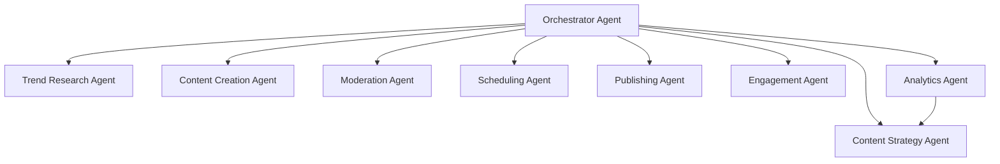

# Social Media AI Agent Platform

An 8-agent AI system that automates social media content strategy, creation, scheduling,
publishing, engagement, moderation, analytics, and trend research across platforms
(X/Twitter, Instagram, LinkedIn, TikTok, Facebook).

## Architecture



See [docs/SYSTEM_DESIGN.md](docs/SYSTEM_DESIGN.md) for full architecture, data model, and
scaling strategy, and [docs/AGENTS.md](docs/AGENTS.md) for each agent's prompt/spec.

## Tech Stack

- **Runtime**: Python 3.11+ (FastAPI backend), TypeScript/React dashboard (optional)
- **Orchestration**: LangGraph-style agent graph (`src/orchestrator`)
- **Queue/Scheduling**: Redis + Celery (or APScheduler for local dev)
- **Storage**: PostgreSQL (metadata), S3-compatible bucket (media assets)
- **LLM**: Pluggable provider interface (`src/llm/provider.py`) — OpenAI/Anthropic/local
- **Platform APIs**: X API v2, Meta Graph API, LinkedIn API, TikTok Content API

## Project Layout

```
social_media_ai_agent/
├── README.md
├── docs/
│   ├── SYSTEM_DESIGN.md
│   └── AGENTS.md
├── .claude/                # Claude Code project config
│   ├── CLAUDE.md           # persistent project memory/instructions
│   ├── settings.json       # hooks configuration
│   ├── hooks/              # hook scripts
│   └── skills/             # one SKILL.md per domain skill
├── src/
│   ├── orchestrator/
│   ├── agents/
│   ├── llm/
│   ├── platforms/
│   ├── api/
│   └── db/
├── config/
│   └── settings.example.env
└── tests/
```

## Getting Started

```powershell
# 1. Clone & install
cd social_media_ai_agent
python -m venv .venv
.venv\Scripts\Activate.ps1
pip install -r requirements.txt

# 2. Configure environment
copy config\settings.example.env .env
# fill in LLM + platform API keys

# 3. Run the API
uvicorn src.api.main:app --reload

# 4. Run the orchestrator worker
python -m src.orchestrator.run
```

## Local Development (Docker Compose)

```powershell
docker compose up --build
```

Starts the API (`:8000`), PostgreSQL, Redis, and a Celery worker. See
[docker-compose.yml](docker-compose.yml) and [Dockerfile](Dockerfile).

## Production Deployment (Kubernetes)

Manifests under [k8s/](k8s/): `namespace.yaml`, `secrets.example.yaml` (copy to `secrets.yaml`
and fill in real values — never commit it), `postgres.yaml`, `redis.yaml`,
`api-deployment.yaml` (Deployment + Service + HPA), `ingress.yaml`.

```powershell
kubectl apply -f k8s/namespace.yaml
kubectl apply -f k8s/secrets.yaml   # your filled-in copy, not the example
kubectl apply -f k8s/postgres.yaml -f k8s/redis.yaml
kubectl apply -f k8s/api-deployment.yaml -f k8s/worker-deployment.yaml -f k8s/ingress.yaml
```

Set `APP_ENV=production` in the secret so the API refuses to boot with insecure default
secrets (`src/security/startup.py`).

## Database Migrations (Alembic)

Schema is defined in [src/db/models.py](src/db/models.py) and versioned with Alembic
([alembic/](alembic/)). Raw SQL mirrors live in [db/migrations/](db/migrations/).

```powershell
alembic upgrade head                      # apply migrations
alembic revision --autogenerate -m "..."  # after changing models.py
```

## Connecting Platform Accounts (OAuth2)

`GET /api/v1/accounts/{platform}/authorize` returns the provider consent URL; the provider
redirects back to `GET /api/v1/accounts/{platform}/callback`, which exchanges the code and
stores only the AES-256-GCM-encrypted token bundle. Supported: `x`, `linkedin`, `facebook`,
`instagram`, `tiktok` (see [src/platforms/oauth/](src/platforms/oauth/)). Inbound
mentions/DMs arrive via signature-verified webhooks (`/webhooks/meta`, `/webhooks/x`).

## Auto-Scheduling

`POST /api/v1/campaigns/{id}/approve` publishes approved content immediately.
`POST /api/v1/campaigns/{id}/schedule` instead queues it into per-platform **optimal time
slots** ([src/scheduling/optimal_times.py](src/scheduling/optimal_times.py)); the Celery-beat
task `scheduling.publish_due_posts` publishes each post once its time arrives. Run the beat
scheduler alongside the worker:

```powershell
celery -A src.orchestrator.tasks.celery_app worker --queues=orchestrator --loglevel=info
celery -A src.orchestrator.tasks.celery_app beat --loglevel=info
```

(Both run as services in `docker-compose.yml` and as Deployments in `k8s/worker-deployment.yaml`.)

## Frontend Admin Dashboard

React 18 + TypeScript under [frontend/](frontend/):

```powershell
cd frontend
npm install
npm run dev
```

See [frontend/src/pages/AdminDashboard.tsx](frontend/src/pages/AdminDashboard.tsx).

## Testing

```powershell
pytest tests/ -q
```

39 tests cover the orchestrator pipeline, API endpoints (auth/campaigns/analytics/accounts/
users/billing), password auth (register + login), DB persistence, OAuth2 authorize/callback,
platform clients + circuit breaker, live-publish token flow, the auto-scheduling engine
(optimal slotting + due-post runner), webhook signature verification, async Celery execution +
persistence, structured logging, and security error paths — see [tests/](tests/).

## The 8 Agents

| # | Agent | Responsibility |
|---|-------|-----------------|
| 1 | Orchestrator | Routes tasks, manages agent handoffs, enforces guardrails |
| 2 | Trend Research | Scans platforms/news for trending topics & hashtags |
| 3 | Content Strategy | Turns trends + brand goals into a content calendar |
| 4 | Content Creation | Generates copy, images/video briefs per platform |
| 5 | Moderation | Brand-safety, policy, and compliance review before publish |
| 6 | Scheduling | Picks optimal send times, queues posts |
| 7 | Publishing | Calls platform APIs, handles retries/rate limits |
| 8 | Engagement | Monitors replies/DMs, drafts responses, flags escalations |
| — | Analytics | Collects performance metrics, feeds back into Strategy |

## API Reference

See `src/api/routes/*.py` for OpenAPI-documented endpoints (`/docs` when running).

## Security

- All platform credentials stored via environment variables / secrets manager, never committed.
- Moderation Agent gates all outbound content before Publishing Agent runs.
- Per-user rate limiting in `src/security/rate_limit.py`; outbound calls use TLS + retry/backoff
  and a per-platform circuit breaker (`src/platforms/http_client.py`, `src/platforms/circuit_breaker.py`).
- Platform credentials/OAuth tokens are AES-256-GCM encrypted at rest (`src/security/crypto.py`);
  every state transition is written to an append-only `audit_log` table.
