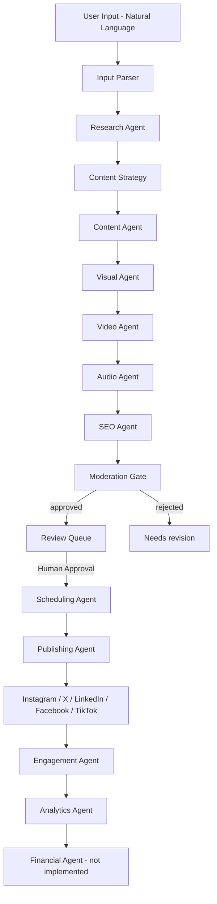

# 🔄 SocialMediaAI — Agent Workflow Specification

## Complete Workflow: User Input → Published Post

### Phase 1: INPUT (0-2 minutes)

```
User enters: "Create a campaign about AI in healthcare for doctors"
    ↓
NLP Parser extracts:
  Topic: "AI in healthcare"
  Target Audience: "doctors"
  Platforms: [instagram, twitter, linkedin] (default)
  Tone: "professional" (default)
  CTA: "Learn more" (default)
    ↓
Output: Structured CampaignRequest object
```

**Implemented.** `CampaignCreateRequest` ([src/api/schemas.py](../src/api/schemas.py)) is the
structured object, accepted by `POST /api/v1/campaigns` (synchronous) or `POST
/api/v1/campaigns/start` (background, with progress polling) in
[src/api/routes/campaigns.py](../src/api/routes/campaigns.py). The extraction itself is
[src/agents/input_parser.py](../src/agents/input_parser.py), the first agent in the pipeline:
it turns `raw_input` into `state.brief` and seeds the Research Agent with the parsed topic.

| Field | Status |
|---|---|
| Topic | ✅ `brief["topic"]` |
| Target audience | ✅ `brief["target_audience"]` |
| Platforms — default `[instagram, twitter, linkedin]` | ✅ request default matches |
| Tone — default `professional` | ✅ request default matches |
| CTA — default `"Learn more"` | ⚠️ no default; `cta` stays `None` unless supplied. The SEO Agent supplies a `lead_cta` fallback downstream instead. |

The parser also extracts `intent` (announce/educate/promote/engage/recruit/celebrate), `goal`,
`key_points`, and `constraints`, which the spec above does not list. Platforms and tone come
from request fields rather than being parsed out of the sentence.

**Also selected at input:** `post_kind` — `text`, `image`, `video`, `audio`, or
`faceless_video` — which gates the generation agents in Phase 3. Blank means "decide per
platform". See [AGENTS.md](AGENTS.md#post-kinds).

### Phase 2: RESEARCH (2-5 minutes)

```
Research Agent executes:
  Web scraping for trending AI healthcare topics
  Competitor analysis on social platforms
  Keyword research (Google Trends API)
  Hashtag analysis
  Audience sentiment analysis
    ↓
Output: ResearchReport with:
  Top 10 trending topics
  20 high-value keywords
  15-20 optimized hashtags
  Competitor post analysis
  Audience pain points
```

**Partly implemented.** [src/agents/trend_research.py](../src/agents/trend_research.py) builds
the report into `state.research`, exposed on the campaign API as `research`.

| Spec output | Status |
|---|---|
| Top 10 trending topics | ✅ `state.trends`, capped at `MAX_TRENDS` |
| 20 high-value keywords | ✅ `research["keywords"]` — `{term, intent, rationale}`, capped at `TARGET_KEYWORDS` |
| 15-20 optimized hashtags | ✅ `research["hashtags"]` — deduped, `#` stripped, capped at `MAX_HASHTAGS` |
| Audience pain points | ✅ `research["pain_points"]` (LLM only — see below) |
| Competitor post analysis | ❌ `research["competitors"]` stays `[]` |

| Spec activity | Status |
|---|---|
| Web scraping for trending topics | ❌ not implemented |
| Keyword research (Google Trends API) | ❌ no trends API; keywords are LLM-derived or extracted from the brief |
| Hashtag analysis | ⚠️ hashtags are generated, not ranked against real reach data |
| Competitor analysis on social platforms | ❌ not implemented |
| Audience sentiment analysis | ❌ needs historical engagement; the Engagement Agent has inbound data but it is not fed back here |

**Everything here is derived, not measured.** There is no live data source, so the agent is
explicitly forbidden from inventing search volumes, follower counts, or competitor metrics —
`competitors` and `search_volumes` stay empty rather than being filled with plausible fiction,
and `pain_points` is empty (not guessed) when no LLM is configured. `research["source"]` records
whether the report came from the LLM or the deterministic fallback.

**Handoff:** the SEO Agent consumes `research["keywords"]` and `research["hashtags"]` rather
than re-deriving its own, so Phase 2 actually drives Phase 3. Caller-supplied trends are never
overwritten — an integration with real trend data can inject it and still get the rest derived
from it.

### Phase 3: CONTENT GENERATION (3-7 minutes)

```
Content Agent executes in parallel:
├─ Instagram Post: 125-150 words, 15-20 hashtags
├─ Twitter Post: Under 280 chars, thread option
├─ LinkedIn Post: 150-300 words, professional tone
└─ Facebook Post: Engaging, community-focused
    ↓
Visual Agent executes:
├─ Instagram image (1080x1080 or 1080x1350)
├─ Twitter image (1200x675)
├─ LinkedIn image (1200x627)
└─ Thumbnails for all platforms
    ↓
Video Agent executes:
├─ YouTube script (60 seconds)
├─ TikTok script (30 seconds)
└─ Thumbnails for video platforms
    ↓
SEO Agent executes:
├─ Keyword optimization
├─ Hashtag strategy
├─ Lead capture form suggestions
└─ Readability & SEO scoring
    ↓
Output: Complete ContentPackage
```

**Implemented, with two caveats.** All four agents exist, plus an Audio Agent the spec above
omits. They run **sequentially**, not in parallel — see
[src/orchestrator/graph.py](../src/orchestrator/graph.py).

| Agent | File | State |
|---|---|---|
| Content | [content_creation.py](../src/agents/content_creation.py) | ✅ per-platform copy respecting `PLATFORM_LIMITS` |
| Visual | [visual.py](../src/agents/visual.py) | ✅ brief always; **renders real images** when `IMAGE_PROVIDER`+`IMAGE_API_KEY` are set, else spec-only |
| Video | [video.py](../src/agents/video.py) | ✅ hook + timed scenes + thumbnail prompt |
| **Audio** | [audio.py](../src/agents/audio.py) | ✅ voiceover script, voice spec, transcript, duration — *not in the spec above* |
| SEO | [seo.py](../src/agents/seo.py) | ✅ keywords, meta description, slug, lead CTA, per-platform hashtag caps |

Which agents run is gated by `post_kind`: an `audio` post gets a voiceover and cover art but
**no video script**; a `text` post gets none of them. Full matrix in
[AGENTS.md](AGENTS.md#post-kinds).

### Per-platform copy shaping

`PLATFORM_SPECS` in [content_creation.py](../src/agents/content_creation.py) carries the
length target and editorial style for each platform, both fed into the drafting prompt:

| Platform | Chars | Word target | Style | Threads |
|---|---|---|---|---|
| Instagram | 2200 | 125-150 ✅ spec | visual-first, hook then short paragraphs | – |
| X | 280 | – | punchy, one idea per post | ✅ |
| LinkedIn | 3000 | 150-300 ✅ spec | professional, insight-led | – |
| Facebook | 5000 | 80-160 | community-focused, invites replies | – |
| TikTok | 2200 | 20-60 | casual, front-loaded hook | – |

**Thread option (X)** — `split_into_thread()` splits overlong copy on sentence boundaries into
numbered parts (`1/n`), each within the limit, capped at `MAX_THREAD_PARTS`. Continuation parts
land in `item.thread`; `item.body` is part 1. Platforms without threads still truncate. This
replaced blanket truncation, which silently discarded the end of every long post.

### Hashtag counts

`PLATFORM_HASHTAG_LIMIT` in [seo.py](../src/agents/seo.py): Instagram 20 (spec's 15-20 range),
TikTok 6, LinkedIn 5, X 3, Facebook 3. Instagram rewards a dense tag set; the others do not,
and stuffing them costs reach.

### Caveats against the spec's numbers

- **Image sizes** now match the spec exactly: Instagram 1080x1350 (4:5), X 1200x675 (16:9),
  LinkedIn 1200x627. `PLATFORM_VISUAL_SPEC` in `visual.py`.
- **YouTube is not a supported platform.** There is no 60-second YouTube script, and adding one
  is not just a runtime entry: `RestPlatformClient` raises `PlatformHttpError` for any platform
  without a configured endpoint, so YouTube would need a Data API client plus its OAuth flow
  before a script could ever be published. TikTok is 30s as specified; Instagram 30s,
  Facebook/X 45s.
- **Agents run sequentially, not in parallel.**

### Phase 4: REVIEW & APPROVAL (User-dependent)

```
Content appears in Review Queue (Admin Panel)
    ↓
User options:
├─ APPROVE → Proceed to publishing
├─ EDIT → Modify content, then approve
├─ REJECT → Send back for regeneration
└─ AUTO-APPROVE → Skip review (trusted campaigns)
```

**All four options implemented.** [moderation.py](../src/agents/moderation.py) sets each item
to `APPROVED`/`REJECTED` before a human ever sees it.

| Option | Endpoint | Behaviour |
|---|---|---|
| APPROVE | `POST /campaigns/{id}/approve` | Schedules and publishes the approved items. |
| EDIT | `PATCH /campaigns/{id}/items/{index}` | Applies the edit, then **re-runs moderation on it**. |
| REJECT | `POST /campaigns/{id}/regenerate` | Clears the generated output and re-drafts it, optionally with `feedback`. |
| AUTO-APPROVE | `auto_publish: true` on create | Skips the human queue and publishes once moderation approves. |

> 🔒 **No review action can bypass the moderation gate.**
>
> - **EDIT** resets the item to `PENDING_MODERATION` and re-runs the gate. Without this a
>   reviewer could approve clean copy, edit banned content into it, and publish — which would
>   defeat the entire gate. It also clears the SEO scores, which were computed for the old copy.
>   Published items cannot be edited (`409`).
> - **AUTO-APPROVE** skips the *human* queue only. Moderation has already run, rejected items
>   stay rejected, and `PublishingAgent` still refuses anything not `APPROVED`.
> Both properties are covered by tests in
> [tests/test_phase4_review.py](../tests/test_phase4_review.py).

**REJECT/regenerate** re-runs only `REGENERATION_PIPELINE` (content → visual → video → audio →
SEO → moderation), deliberately **not** input-parser/research/strategy: those *append* calendar
items, so re-running them would duplicate the campaign rather than redo it. `feedback` is passed
to the Content Agent as `revision_notes` so the retry addresses the objection. Target one item
with `item_index`, or omit it to redo the whole calendar; published items are skipped.

UI: edit and regenerate are inline on each post card in
[PostDetailPage.tsx](../frontend/src/pages/app/PostDetailPage.tsx); the admin queue is
[CampaignReviewQueue.tsx](../frontend/src/components/CampaignReviewQueue.tsx).

### Phase 5: SCHEDULING & PUBLISHING (Automated)

```
Publishing Agent calculates optimal times:
  Instagram: 11 AM - 1 PM, 7 PM - 9 PM
  LinkedIn: 8 AM - 10 AM, 12 PM - 2 PM (weekdays)
  Twitter: 9 AM, 12 PM, 3 PM, 6 PM
    ↓
Queues content for each platform
    ↓
Executes posting via OAuth APIs
    ↓
Captures post IDs and URLs
    ↓
Output: PublishedPosts with tracking IDs
```

**Scheduling implemented, in the audience's own timezone.**
[optimal_times.py](../src/scheduling/optimal_times.py) holds the windows above as
**audience-local** hours; `next_optimal_slot()` converts into `state.timezone`, finds the next
preferred hour, and returns UTC for storage. So "9 AM" means 9 AM where the audience is, while
the scheduler and DB stay in UTC.

| Platform | Local window |
|---|---|
| Instagram | 11 AM-1 PM, 7 PM-9 PM |
| LinkedIn | 8-10 AM, 12-2 PM (weekdays only) |
| X | 9 AM, 12 PM, 3 PM, 6 PM |

Default timezone is **`Asia/Kolkata`** (IST); override per campaign with `timezone` on the
create request. Note IST is UTC+05:30, so an on-the-hour local slot is stored on the half hour
in UTC — that is correct, not a rounding bug. An unknown timezone degrades to the default and
then to UTC rather than failing the campaign. `tzdata` is a dependency because slim container
images ship without a system tz database, and zoneinfo would otherwise silently fall back to
UTC and put every post 5.5 hours out.

[scheduling.py](../src/agents/scheduling.py) assigns slots with a 2-hour minimum gap per
platform so a campaign does not burst-post.

**Publishing implemented**: [publishing.py](../src/agents/publishing.py) +
[http_client.py](../src/platforms/http_client.py) (tenacity retry/backoff, circuit breaker),
and OAuth **is** wired — [src/platforms/oauth/](../src/platforms/oauth/) with
`GET /api/v1/accounts/{platform}/authorize` and a callback route. Without a connected account
the publisher runs in **simulate** mode and returns a synthetic `…-sim-…` id.

**Post IDs and URLs are captured.** `external_post_id` always; `external_post_url` via
`build_post_url()` for platforms whose id maps onto a public permalink (X, LinkedIn, Facebook,
TikTok). It returns `None` — deliberately, rather than a plausible-looking dead link — for:
- **simulated posts**, which do not exist;
- **Instagram**, whose Graph API media id is *not* the `/p/<shortcode>` used in permalinks.
  Instagram returns a `permalink` field on the media object; capturing that is the correct fix
  and is not yet wired.

> 🚨 **Scheduled posts do not currently publish in production.** The due-post runner is a
> Celery beat task and no worker/beat service is deployed — see
> [DEPLOYMENT.md §5](DEPLOYMENT.md). Approve-and-publish-now works; "schedule for later" does
> not fire until that service exists.

### Phase 6: ANALYTICS & OPTIMIZATION (Ongoing)

```
Analytics Agent tracks:
  Engagement (likes, comments, shares)
  Reach and impressions
  Click-through rates
  Lead generation
    ↓
SEO Agent monitors:
  Organic growth
  Search rankings
  Backlink opportunities
    ↓
Generates suggestions for improvement
    ↓
Output: Performance Dashboard + Recommendations
```

**Analytics implemented.** [analytics.py](../src/agents/analytics.py) now pulls each published
post's metrics via `RestPlatformClient.fetch_metrics`, stores them on `item.metrics`, appends a
snapshot to `state.analytics`, and writes improvement suggestions to `state.recommendations`.
Rollups and recommendations surface on `GET /api/v1/analytics/dashboard` and in
[AnalyticsBoard.tsx](../frontend/src/components/AnalyticsBoard.tsx).

| Spec item | Status |
|---|---|
| Engagement (likes, comments, shares) | ✅ per post and aggregated |
| Reach and impressions | ✅ |
| Click-through rates | ⚠️ computed **only** when the platform reports clicks; otherwise `None`, never 0 |
| Lead generation | ❌ no conversion tracking exists — nothing to measure |
| Organic growth / search rankings / backlinks | ❌ needs Search Console or an SEO vendor API; not wired |
| Suggestions for improvement | ✅ [src/analytics/insights.py](../src/analytics/insights.py) |
| Performance dashboard | ✅ |

### What the recommendation engine will and will not say

Two rules keep it from manufacturing insight:

- **No advice from a sample of one.** A comparative claim needs `MIN_POSTS_PER_GROUP` posts in
  each of `MIN_GROUPS_FOR_COMPARISON` groups, and a gap of at least `MIN_MEANINGFUL_GAP`.
  Below that it says so, rather than declaring a winner from noise.
- **Absent data stays absent.** Simulated posts and all-zero metric responses are *not*
  recorded — zeros are indistinguishable from "not measured yet" and would drag every average
  toward zero. With nothing measured the dashboard says "no performance data yet" instead of
  showing a confident 0%.

Metrics failures are swallowed and logged: analytics is a read-only feedback loop, so an
outage should cost insight, not the campaign.

> ⚠️ **The `analytics` table is unused, deliberately.** `_project_posts` deletes and re-creates
> every `Post` row on each campaign save, and `Analytics.post_id` cascades — so snapshots
> written there would be destroyed by the next write, despite the table being documented
> append-only. Snapshots therefore live in the campaign's `state_json`. Using the table
> properly requires stable post identity (match on `external_post_id` and upsert instead of
> rebuilding the projection).

### Phase 7: REVENUE & REPORTING (Weekly/Monthly)

```
Financial Agent calculates:
  Campaign ROI
  Cost per lead
  Revenue attribution
    ↓
Generates client reports
    ↓
Processes subscription billing
    ↓
Output: Revenue Reports + Growth Insights
```

**Partly implemented.** [src/finance/reports.py](../src/finance/reports.py) builds the report
from Stripe-fed `subscriptions`/`invoices` plus measured generation cost;
`GET /api/v1/admin/revenue-report` serves it, and
[FinancialManagement.tsx](../frontend/src/components/FinancialManagement.tsx) renders it.

| Spec item | Status |
|---|---|
| Revenue reports (MRR / ARR, invoices) | ✅ from real subscription + invoice rows |
| Growth insights | ✅ churn, past-due, recent billing |
| Generation cost | ✅ exact token counts; dollars only when rates are configured |
| Processes subscription billing | ✅ existing Stripe Checkout + webhook |
| **Campaign ROI** | ❌ reported `unavailable` |
| **Cost per lead** | ❌ reported `unavailable` |
| **Revenue attribution** | ❌ reported `unavailable` |

### Why three metrics are absent rather than estimated

ROI needs revenue attributed to a campaign, and **nothing links a payment back to the post that
earned it** — no UTM tagging, no conversion events, no attribution window. Cost per lead needs
a lead count, and no lead capture exists anywhere in the system (see also Phase 6). Rather than
divide by an invented number, the report returns each under `unavailable` with the reason and
exactly what would be needed to compute it.

The **cost** half of ROI is real: `generation_cost` is measured LLM token spend, accumulated
per campaign in `state.usage` via [src/llm/usage.py](../src/llm/usage.py). Token counts are
exact. Dollar figures appear **only** when the operator sets `LLM_COST_PER_MTOK_INPUT` /
`_OUTPUT` in Integrations — we never guess at pricing, and an unpriced run reports `None`
rather than `0.0`, which would read as "this was free".

Enterprise subscriptions are counted as paying accounts but contribute `0` to MRR, because
they are contract-priced and assuming a number would fabricate revenue.

## Error Handling & Recovery

| Error Type | Recovery Strategy | Current implementation |
|---|---|---|
| Research Error | Retry with broader search terms | not yet implemented |
| Content Generation Error | Fallback to template-based generation | `ContentCreationAgent` uses a simple template today (no LLM fallback logic yet) |
| Publishing Error | Add to retry queue (exponential backoff) | `publish_post` retries via `tenacity` (3 attempts, exponential jitter); `PublishingAgent` catches `PlatformHttpError` and marks the item `FAILED` |
| API Rate Limit | Exponential backoff, queue for later | `src/security/rate_limit.py` rejects with 429 (per-user, per-tier); backoff-and-requeue on inbound 429 from platforms is a TODO in `publish_post` |
| Unknown Error | Escalate to human operator | `PublishingAgent`/`http_client.py` convert unexpected exceptions to `PlatformHttpError` and log via `src/logging_config.py`; no human escalation queue yet |

## 📊 Platform Feature Matrix

| Feature | Free | Starter | Pro | Agency | Enterprise |
|---|---|---|---|---|---|
| Posts/Month | 3 | 30 | 100 | Unlimited | Unlimited |
| Platforms | 1 | 3 | 5 | All | All |
| AI Images | ❌ | ✅ | ✅ | ✅ | ✅ |
| Video Generation | ❌ | ❌ | ✅ | ✅ | ✅ |
| SEO Tools | ❌ | ❌ | ✅ | ✅ | ✅ |
| Lead Tracking | ❌ | ❌ | ✅ | ✅ | ✅ |
| Team Collaboration | ❌ | ❌ | ❌ | ✅ | ✅ |
| White-Label | ❌ | ❌ | ❌ | ✅ | ✅ |
| API Access | ❌ | ❌ | ❌ | ✅ | ✅ |
| Custom AI Training | ❌ | ❌ | ❌ | ❌ | ✅ |
| Dedicated Support | ❌ | ❌ | ❌ | ❌ | ✅ |

See [REVENUE_MODEL.md](../REVENUE_MODEL.md) for pricing and unit economics.

## 🎯 Key Success Metrics

| Metric | Target |
|---|---|
| Time to First Post | < 5 minutes |
| Content Approval Rate | > 85% |
| Publishing Success Rate | > 99% |
| User Retention (30-day) | > 60% |
| NPS Score | > 50 |
| API Uptime | 99.9% |

## High-Level Flow

As actually executed by [src/orchestrator/graph.py](../src/orchestrator/graph.py) — sequential,
not parallel. Visual/video/audio/SEO sit **before** moderation so every generated asset is
reviewed, not just the copy; audio runs after video so it can voice that script.



`post_kind` decides whether the Visual, Video, and Audio nodes do any work for a given item;
each no-ops cheaply when the kind does not need it.
