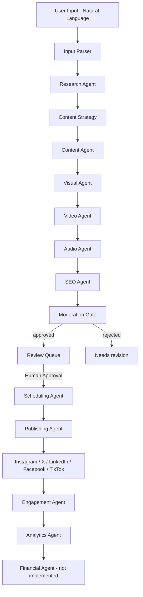

# 🔄 SocialMediaAI — Agent Workflow Specification

## Complete Workflow: User Input → Published Post

### Phase 1: INPUT (0-2 minutes)

```
User enters: "Create a campaign about AI in healthcare for doctors"
    ↓
NLP Parser extracts:
  Topic: "AI in healthcare"
  Target Audience: "doctors"
  Platforms: [instagram, twitter, linkedin] (default)
  Tone: "professional" (default)
  CTA: "Learn more" (default)
    ↓
Output: Structured CampaignRequest object
```

**Implemented.** `CampaignCreateRequest` ([src/api/schemas.py](../src/api/schemas.py)) is the
structured object, accepted by `POST /api/v1/campaigns` (synchronous) or `POST
/api/v1/campaigns/start` (background, with progress polling) in
[src/api/routes/campaigns.py](../src/api/routes/campaigns.py). The extraction itself is
[src/agents/input_parser.py](../src/agents/input_parser.py), the first agent in the pipeline:
it turns `raw_input` into `state.brief` and seeds the Research Agent with the parsed topic.

| Field | Status |
|---|---|
| Topic | ✅ `brief["topic"]` |
| Target audience | ✅ `brief["target_audience"]` |
| Platforms — default `[instagram, twitter, linkedin]` | ✅ request default matches |
| Tone — default `professional` | ✅ request default matches |
| CTA — default `"Learn more"` | ⚠️ no default; `cta` stays `None` unless supplied. The SEO Agent supplies a `lead_cta` fallback downstream instead. |

The parser also extracts `intent` (announce/educate/promote/engage/recruit/celebrate), `goal`,
`key_points`, and `constraints`, which the spec above does not list. Platforms and tone come
from request fields rather than being parsed out of the sentence.

**Also selected at input:** `post_kind` — `text`, `image`, `video`, `audio`, or
`faceless_video` — which gates the generation agents in Phase 3. Blank means "decide per
platform". See [AGENTS.md](AGENTS.md#post-kinds).

### Phase 2: RESEARCH (2-5 minutes)

```
Research Agent executes:
  Web scraping for trending AI healthcare topics
  Competitor analysis on social platforms
  Keyword research (Google Trends API)
  Hashtag analysis
  Audience sentiment analysis
    ↓
Output: ResearchReport with:
  Top 10 trending topics
  20 high-value keywords
  15-20 optimized hashtags
  Competitor post analysis
  Audience pain points
```

Baseline today: [src/agents/trend_research.py](../src/agents/trend_research.py) returns
`{topic, score, source, rationale}` per trend; web scraping/Google Trends/competitor analysis
are not yet wired up (see [IMPLEMENTATION_PLAN.md](../IMPLEMENTATION_PLAN.md) Phase 2).

### Phase 3: CONTENT GENERATION (3-7 minutes)

```
Content Agent executes in parallel:
├─ Instagram Post: 125-150 words, 15-20 hashtags
├─ Twitter Post: Under 280 chars, thread option
├─ LinkedIn Post: 150-300 words, professional tone
└─ Facebook Post: Engaging, community-focused
    ↓
Visual Agent executes:
├─ Instagram image (1080x1080 or 1080x1350)
├─ Twitter image (1200x675)
├─ LinkedIn image (1200x627)
└─ Thumbnails for all platforms
    ↓
Video Agent executes:
├─ YouTube script (60 seconds)
├─ TikTok script (30 seconds)
└─ Thumbnails for video platforms
    ↓
SEO Agent executes:
├─ Keyword optimization
├─ Hashtag strategy
├─ Lead capture form suggestions
└─ Readability & SEO scoring
    ↓
Output: Complete ContentPackage
```

**Implemented, with two caveats.** All four agents exist, plus an Audio Agent the spec above
omits. They run **sequentially**, not in parallel — see
[src/orchestrator/graph.py](../src/orchestrator/graph.py).

| Agent | File | State |
|---|---|---|
| Content | [content_creation.py](../src/agents/content_creation.py) | ✅ per-platform copy respecting `PLATFORM_LIMITS` |
| Visual | [visual.py](../src/agents/visual.py) | ✅ brief always; **renders real images** when `IMAGE_PROVIDER`+`IMAGE_API_KEY` are set, else spec-only |
| Video | [video.py](../src/agents/video.py) | ✅ hook + timed scenes + thumbnail prompt |
| **Audio** | [audio.py](../src/agents/audio.py) | ✅ voiceover script, voice spec, transcript, duration — *not in the spec above* |
| SEO | [seo.py](../src/agents/seo.py) | ✅ keywords, meta description, slug, lead CTA, per-platform hashtag caps |

Which agents run is gated by `post_kind`: an `audio` post gets a voiceover and cover art but
**no video script**; a `text` post gets none of them. Full matrix in
[AGENTS.md](AGENTS.md#post-kinds).

Caveats against the spec's numbers:
- **Image sizes**: LinkedIn 1200x627 matches; Instagram uses 1080x1350 (4:5). X uses 1600x900
  rather than 1200x675 — same 16:9 ratio, larger. `PLATFORM_VISUAL_SPEC` in `visual.py`.
- **YouTube is not a supported platform**, so there is no 60-second YouTube script. TikTok is
  30s as specified; Instagram 30s, Facebook/X 45s.

### Phase 4: REVIEW & APPROVAL (User-dependent)

```
Content appears in Review Queue (Admin Panel)
    ↓
User options:
├─ APPROVE → Proceed to publishing
├─ EDIT → Modify content, then approve
├─ REJECT → Send back for regeneration
└─ AUTO-APPROVE → Skip review (trusted campaigns)
```

Implemented today: [src/agents/moderation.py](../src/agents/moderation.py) sets each item to
`APPROVED`/`REJECTED`; `POST /api/v1/campaigns/{id}/approve` is the human trigger for the next
phase. `EDIT` and `AUTO-APPROVE` (per-brand `auto_publish` flag) are not yet wired into the API.
UI: [CampaignReviewQueue.tsx](../frontend/src/components/CampaignReviewQueue.tsx).

### Phase 5: SCHEDULING & PUBLISHING (Automated)

```
Publishing Agent calculates optimal times:
  Instagram: 11 AM - 1 PM, 7 PM - 9 PM
  LinkedIn: 8 AM - 10 AM, 12 PM - 2 PM (weekdays)
  Twitter: 9 AM, 12 PM, 3 PM, 6 PM
    ↓
Queues content for each platform
    ↓
Executes posting via OAuth APIs
    ↓
Captures post IDs and URLs
    ↓
Output: PublishedPosts with tracking IDs
```

**Scheduling implemented.** [src/scheduling/optimal_times.py](../src/scheduling/optimal_times.py)
holds ranked preferred hours per platform and `next_optimal_slot()` finds the next one;
[scheduling.py](../src/agents/scheduling.py) assigns slots with a 2-hour minimum gap per
platform so a campaign does not burst-post. LinkedIn skips weekends.

⚠️ The hours are stored in **UTC**, whereas the windows quoted above read as local time — so
actual send times differ from the table unless your audience is UTC. Per-audience timezone
resolution is not implemented.

**Publishing implemented**: [publishing.py](../src/agents/publishing.py) +
[http_client.py](../src/platforms/http_client.py) (tenacity retry/backoff, circuit breaker),
and OAuth **is** wired — [src/platforms/oauth/](../src/platforms/oauth/) with
`GET /api/v1/accounts/{platform}/authorize` and a callback route. Without a connected account
the publisher runs in **simulate** mode and returns a synthetic `…-sim-…` id.

> 🚨 **Scheduled posts do not currently publish in production.** The due-post runner is a
> Celery beat task and no worker/beat service is deployed — see
> [DEPLOYMENT.md §5](DEPLOYMENT.md). Approve-and-publish-now works; "schedule for later" does
> not fire until that service exists.

### Phase 6: ANALYTICS & OPTIMIZATION (Ongoing)

```
Analytics Agent tracks:
  Engagement (likes, comments, shares)
  Reach and impressions
  Click-through rates
  Lead generation
    ↓
SEO Agent monitors:
  Organic growth
  Search rankings
  Backlink opportunities
    ↓
Generates suggestions for improvement
    ↓
Output: Performance Dashboard + Recommendations
```

Baseline today: [src/agents/analytics.py](../src/agents/analytics.py) records a published-count
snapshot; per-post engagement pulls and SEO monitoring are Phase 5 work. UI:
[AnalyticsBoard.tsx](../frontend/src/components/AnalyticsBoard.tsx).

### Phase 7: REVENUE & REPORTING (Weekly/Monthly)

```
Financial Agent calculates:
  Campaign ROI
  Cost per lead
  Revenue attribution
    ↓
Generates client reports
    ↓
Processes subscription billing
    ↓
Output: Revenue Reports + Growth Insights
```

Not yet implemented (Phase 6 of [IMPLEMENTATION_PLAN.md](../IMPLEMENTATION_PLAN.md)). Data
model exists: `subscriptions`/`invoices` in [src/db/models.py](../src/db/models.py); UI stub:
[FinancialManagement.tsx](../frontend/src/components/FinancialManagement.tsx).

## Error Handling & Recovery

| Error Type | Recovery Strategy | Current implementation |
|---|---|---|
| Research Error | Retry with broader search terms | not yet implemented |
| Content Generation Error | Fallback to template-based generation | `ContentCreationAgent` uses a simple template today (no LLM fallback logic yet) |
| Publishing Error | Add to retry queue (exponential backoff) | `publish_post` retries via `tenacity` (3 attempts, exponential jitter); `PublishingAgent` catches `PlatformHttpError` and marks the item `FAILED` |
| API Rate Limit | Exponential backoff, queue for later | `src/security/rate_limit.py` rejects with 429 (per-user, per-tier); backoff-and-requeue on inbound 429 from platforms is a TODO in `publish_post` |
| Unknown Error | Escalate to human operator | `PublishingAgent`/`http_client.py` convert unexpected exceptions to `PlatformHttpError` and log via `src/logging_config.py`; no human escalation queue yet |

## 📊 Platform Feature Matrix

| Feature | Free | Starter | Pro | Agency | Enterprise |
|---|---|---|---|---|---|
| Posts/Month | 3 | 30 | 100 | Unlimited | Unlimited |
| Platforms | 1 | 3 | 5 | All | All |
| AI Images | ❌ | ✅ | ✅ | ✅ | ✅ |
| Video Generation | ❌ | ❌ | ✅ | ✅ | ✅ |
| SEO Tools | ❌ | ❌ | ✅ | ✅ | ✅ |
| Lead Tracking | ❌ | ❌ | ✅ | ✅ | ✅ |
| Team Collaboration | ❌ | ❌ | ❌ | ✅ | ✅ |
| White-Label | ❌ | ❌ | ❌ | ✅ | ✅ |
| API Access | ❌ | ❌ | ❌ | ✅ | ✅ |
| Custom AI Training | ❌ | ❌ | ❌ | ❌ | ✅ |
| Dedicated Support | ❌ | ❌ | ❌ | ❌ | ✅ |

See [REVENUE_MODEL.md](../REVENUE_MODEL.md) for pricing and unit economics.

## 🎯 Key Success Metrics

| Metric | Target |
|---|---|
| Time to First Post | < 5 minutes |
| Content Approval Rate | > 85% |
| Publishing Success Rate | > 99% |
| User Retention (30-day) | > 60% |
| NPS Score | > 50 |
| API Uptime | 99.9% |

## High-Level Flow

As actually executed by [src/orchestrator/graph.py](../src/orchestrator/graph.py) — sequential,
not parallel. Visual/video/audio/SEO sit **before** moderation so every generated asset is
reviewed, not just the copy; audio runs after video so it can voice that script.



`post_kind` decides whether the Visual, Video, and Audio nodes do any work for a given item;
each no-ops cheaply when the kind does not need it.
