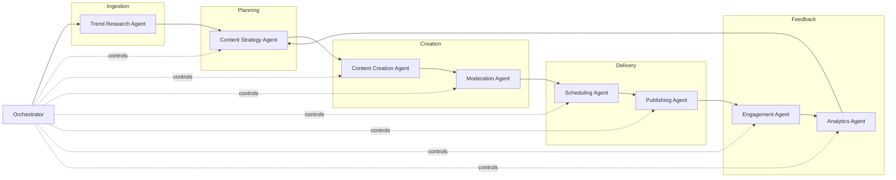

# System Design — Social Media AI Agent Platform

## 1. Goals

- Automate end-to-end social media operations: research → strategy → creation →
  moderation → scheduling → publishing → engagement → analytics.
- Support multiple brands/accounts and multiple platforms simultaneously.
- Keep a human-in-the-loop approval gate configurable per brand (auto-publish vs. review queue).

## 2. High-Level Architecture



The Orchestrator is a state machine (LangGraph-style) that owns a `CampaignState` object and
routes it through agents. Each agent is a pure function: `(state) -> state'` plus side effects
(API calls) that are logged for observability/replay.

## 3. Data Model (PostgreSQL)

```sql
-- brands / accounts
CREATE TABLE brands (
    id UUID PRIMARY KEY,
    name TEXT NOT NULL,
    voice_guidelines JSONB,
    auto_publish BOOLEAN DEFAULT FALSE
);

CREATE TABLE platform_accounts (
    id UUID PRIMARY KEY,
    brand_id UUID REFERENCES brands(id),
    platform TEXT CHECK (platform IN ('x','instagram','linkedin','tiktok','facebook')),
    credentials_ref TEXT NOT NULL, -- pointer into secrets manager, never raw secret
    rate_limit_window JSONB
);

-- content pipeline
CREATE TABLE trends (
    id UUID PRIMARY KEY,
    brand_id UUID REFERENCES brands(id),
    topic TEXT,
    score NUMERIC,
    source TEXT,
    discovered_at TIMESTAMPTZ DEFAULT now()
);

CREATE TABLE content_items (
    id UUID PRIMARY KEY,
    brand_id UUID REFERENCES brands(id),
    trend_id UUID REFERENCES trends(id),
    platform TEXT,
    body TEXT,
    media_refs JSONB,
    status TEXT CHECK (status IN
        ('draft','pending_moderation','approved','rejected','scheduled','published','failed')),
    scheduled_at TIMESTAMPTZ,
    published_at TIMESTAMPTZ,
    created_at TIMESTAMPTZ DEFAULT now()
);

CREATE TABLE moderation_reviews (
    id UUID PRIMARY KEY,
    content_id UUID REFERENCES content_items(id),
    verdict TEXT CHECK (verdict IN ('approved','rejected','needs_human')),
    reasons JSONB,
    reviewed_at TIMESTAMPTZ DEFAULT now()
);

CREATE TABLE engagements (
    id UUID PRIMARY KEY,
    content_id UUID REFERENCES content_items(id),
    type TEXT CHECK (type IN ('comment','reply','dm','mention')),
    external_id TEXT,
    text TEXT,
    draft_response TEXT,
    escalated BOOLEAN DEFAULT FALSE,
    handled_at TIMESTAMPTZ
);

CREATE TABLE analytics_snapshots (
    id UUID PRIMARY KEY,
    content_id UUID REFERENCES content_items(id),
    impressions BIGINT,
    likes BIGINT,
    shares BIGINT,
    comments BIGINT,
    captured_at TIMESTAMPTZ DEFAULT now()
);
```

## 4. API Design (FastAPI)

- `POST /brands` / `GET /brands/{id}` — brand management
- `POST /campaigns/{brand_id}/run` — trigger orchestrator cycle
- `GET /content?status=pending_moderation` — review queue
- `POST /content/{id}/approve` / `POST /content/{id}/reject` — human-in-loop gate
- `GET /analytics/{brand_id}/summary` — rollup metrics
- Webhooks: `/webhooks/x`, `/webhooks/meta` for inbound mentions/DMs

All write endpoints require an API key + brand-scoped RBAC. Rate limited via `slowapi`.

## 5. Security

- Secrets never stored in DB/code — only references to a secrets manager (AWS Secrets Manager /
  Azure Key Vault / Vault).
- Moderation Agent is a mandatory gate; Publishing Agent refuses to run on `status != approved`.
- All outbound HTTP calls to platform APIs go through `src/platforms/http_client.py`, which
  enforces TLS, timeout, and retry/backoff with jitter.
- Input validation with Pydantic models on every API boundary (OWASP A03 injection prevention).
- Audit log table for every state transition (who/what/when) for compliance.

## 6. Scaling Strategy

- Stateless FastAPI instances behind a load balancer; horizontal scale.
- Celery workers (one queue per agent type) so slow LLM calls don't block scheduling/publishing.
- Redis for queue + short-lived caching of trend scores.
- Read replicas for analytics rollups; partition `analytics_snapshots` by month.
- Circuit breakers per platform API to isolate failures (e.g., X API outage doesn't block
  Instagram publishing).
